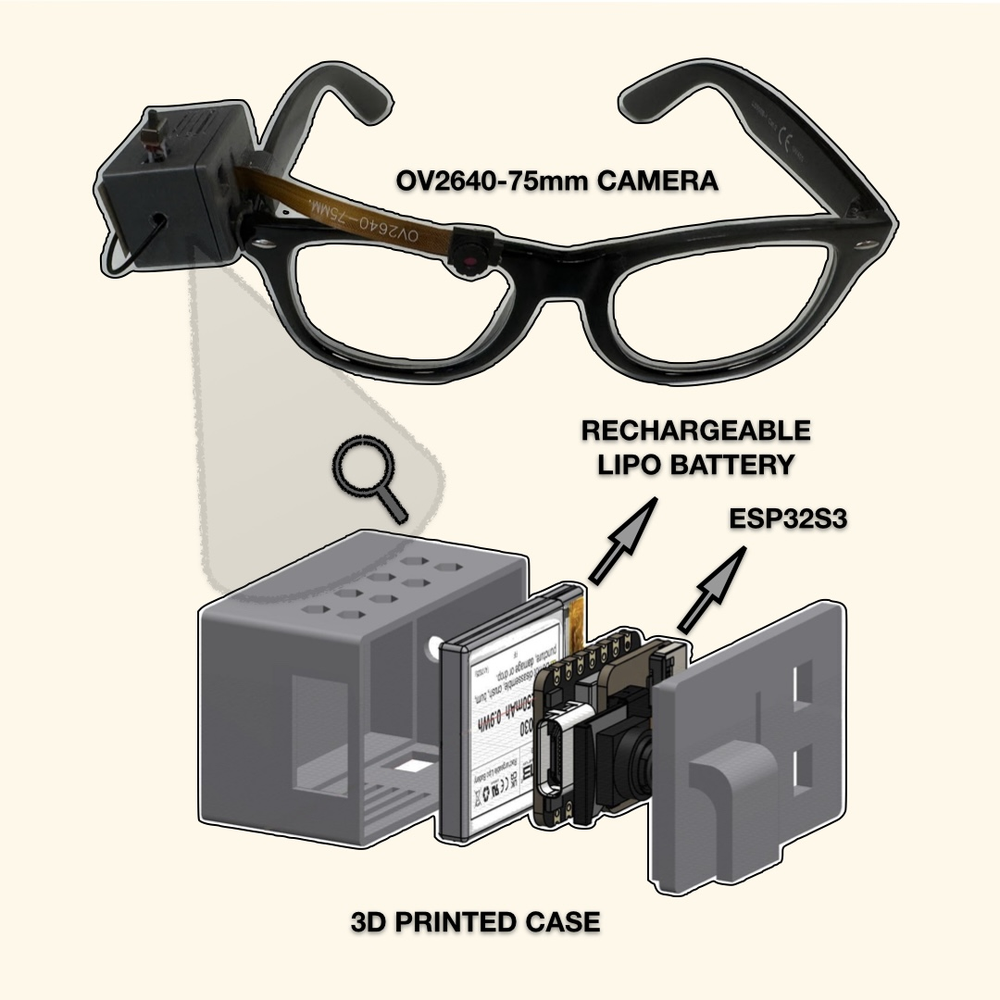
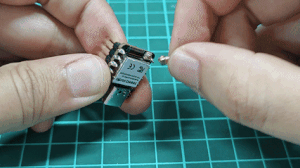
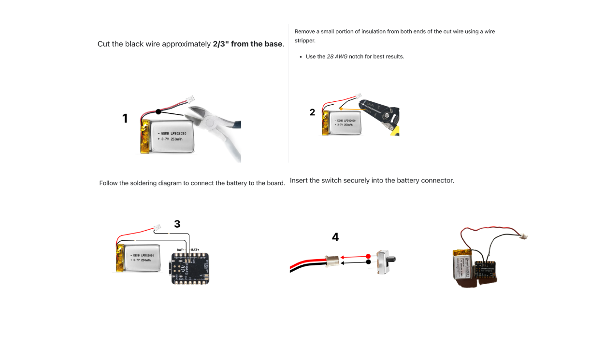
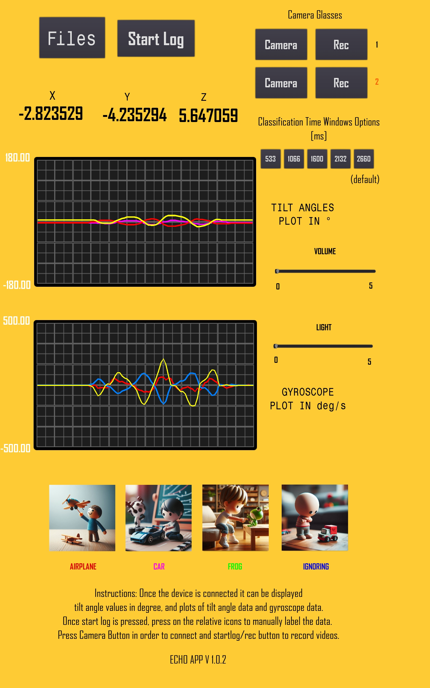
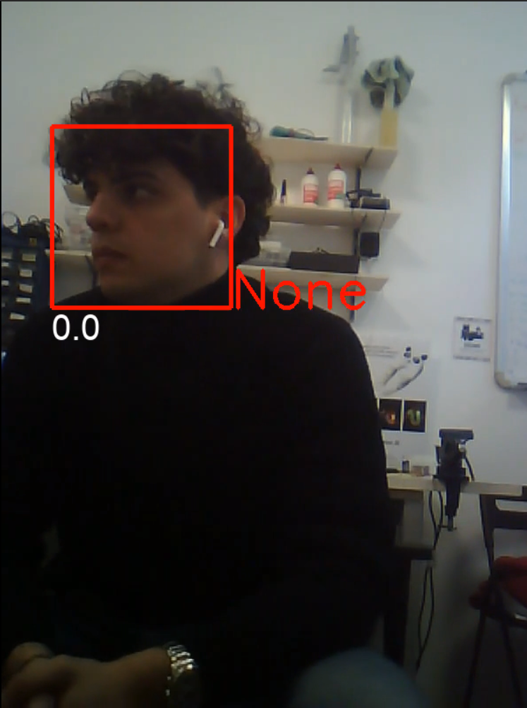

# Camera_Glasses • Wearable camera system for synchronized multimodal data collection and research applications



---

## Overview
The **Camera_Glasses** project provides a compact, wearable vision system based on the ESP32 microcontroller for synchronized multimodal data acquisition.  
The device records and streams video, interfaces via **Bluetooth** with the **ECHO** and **IM‑TWIN** Android applications, and integrates seamlessly with the **Platform Application** for synchronized analysis.

---

## Bill of Materials
| Component | Description | Link |
|------------|--------------|------|
| LP502030 3.7 V 250 mAh Li‑ion Polymer Battery | Rechargeable | [Amazon](https://amzn.eu/d/fRJ3vzB) |
| 3D Printed Case | STL provided in repo | GitHub |
| OV2640 2 MP 20 cm Camera Module (66° FOV) | Main sensor | [AliExpress](https://www.aliexpress.com) |
| Xiao ESP32 Module | Main controller | [AliExpress](https://www.aliexpress.com) |
| Misc. | Wires, switch, solder, 3M bioadhesive tape, super glue | — |

---

## Hardware Assembly

### Components Overview


Follow the steps to assemble the prototype:

1. **3D print** the case (STL files provided in the repository).  
2. **Install** the antenna, expansion board, and 200 mm OV2640 camera.  
3. **Insert** a FAT32‑formatted microSD card.  
4. **Connect** the battery, switch, and camera module as shown below.  
5. **Assemble** and close the case, ensuring that the camera cable passes through the slot without bending.


### Battery and Switch Preparation


Ensure proper soldering of the switch and battery following the indicated diagram.

---

## Firmware Installation

1. Clone the repository:  
   ```bash
   git clone https://github.com/giampierobartolomei/Camera_Glasses.git
   ```
2. Copy the `data` folder (`CameraGlass/ESP32‑CAM_MJPEG2SD/data`) to the microSD card.  
3. Open the `.ino` file in Arduino IDE and check these settings:  
   - **Espressif Core:** 3.1.1  
   - **PSRAM:** Enabled (`Tools > PSRAM > OPI_PSRAM`)  
   - **Partition Scheme:** 3 MB APP  
4. If the upload fails, press and hold the **Boot** button while connecting the USB cable, then release it once uploading starts.

---

## First Use

The device now operates **via Bluetooth** only (Wi‑Fi mode deprecated).  
Default settings are pre‑loaded: **SVGA (800×600), 20 fps, motion detect disabled**.

### Recording Control Options

#### 1. Using Smartphone (nRF Connect)
- Connect to **CameraModule** via Bluetooth.  
- Send the UTF‑8 string commands:  
  - `rec` → start recording  
  - `stp` → stop recording  

#### 2. Using ECHO or IM‑TWIN Android App
- Connect the **TWC device** and tap the **Camera** button.  
- Once connected, the button turns **green**.  
- Tap **Rec** to start/stop recording.  
- The orange LED on the glasses blinks during active recording.



---

## Computer Vision Integration

To process recorded videos with the **Computer Vision repository**:

1. Record video and save it to the microSD card.  
2. Copy `.avi` file to the computer and convert to `.mp4`:  
   ```bash
   ffmpeg -i input.avi -c:v libx264 -crf 23 -preset medium -c:a aac -b:a 128k output.mp4
   ```
3. If rotation is needed:  
   ```bash
   ffmpeg -i output.mp4 -vf "transpose=2" -c:a copy output_r.mp4
   ```

To synchronize with ECHO logs:
1. Save ECHO log as `.csv`.  
2. Process using `downsampling.py` and `plotanimation.py` (available in the **Echo repository**).  
3. Compare results using **Platform Application** for unified visualization.



---

## Charging and Power Monitoring

- Connect a **USB‑C cable** while the device is ON.  
- The red LED inside the port blinks during charging and turns off when complete.  
- The orange LED indicates device power.  
- For battery voltage reading, use a 100 kΩ + 100 kΩ voltage divider (D4 → GND / Battery +).

---

## Platform Integration

1. Mount **Camera Glasses** and **ECHO**.  
2. Flash firmware and install the **ECHO App**.  
3. Turn on both devices (red LED for ECHO, orange LED for glasses).  
4. Connect via the app; both camera buttons should turn green when ready.  
5. Press **Start LOG** to begin synchronized recording.  
6. For new sessions, restart the app to ensure correct timestamps.  
7. Save logs and videos, convert with FFmpeg, and load into the **Platform Application** for analysis.


---

## Output Example


Example frame showing real‑time gaze detection bounding boxes and classification output.

---

## Repository Layout
```
Camera_Glasses/
├─ firmware/                # Arduino firmware (.ino)
├─ data/                    # Web UI / static assets
├─ 3d_models/               # STL case and lens holder
├─ docs/                    # images, diagrams
└─ README.md
```

---

## License
Code released under the **MIT License**.  
Images and documentation under **CC BY 4.0**.

---

## Citation
If you use Camera_Glasses in academic work, please cite this repository and the related Echo and Platform publications.

---


